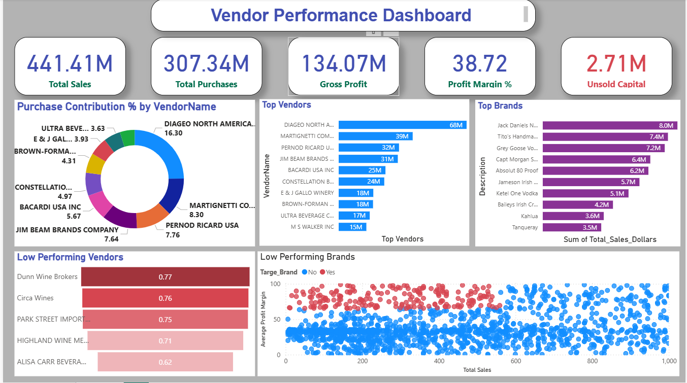

# Vendor Performance Analysis – Retail Inventory & Sales
Analyzing vendor efficiency and profitability to support strategic purchasing and inventory decisions using SQL, Python, and Power BI.

## Table of Contents
- [Overview](#overview)
- [Business Problem](#business-problem)
- [Dataset](#dataset)
- [Tools & Technologies](#tools--technologies)
- [Project Structure](#project-structure)
- [Data Cleaning & Preparation](#data-cleaning--preparation)
- [Exploratory Data Analysis (EDA)](#exploratory-data-analysis-eda)
- [Research Questions & Key Findings](#research-questions--key-findings)
- [Dashboard](#dashboard)
- [How to Run This Project](#how-to-run-this-project)
- [Final Recommendations](#final-recommendations)
- [Author & Contact](#author--contact)

# Overview
This project evaluates vendor performance and retail inventory dynamics to drive strategic insights for purchasing, pricing, and inventory optimization.  
A complete data pipeline was built using **SQL** for ETL, **Python** for analysis and hypothesis testing, and **Power BI** for visualization.

# Business Problem
Effective inventory and sales management are critical in the retail sector. This project aims to:

- Identify underperforming brands needing pricing or promotional adjustments
- Determine vendor contributions to sales and profits
- Analyze the cost-benefit of bulk purchasing
- Investigate inventory turnover inefficiencies
- Statistically validate differences in vendor profitability

# Dataset
- Multiple CSV files located in `/data/` folder (sales, vendors, inventory)
- Summary table created from ingested data and used for analysis

# Tools & Technologies
- **SQL** (Common Table Expressions, Joins, Filtering)
- **Python** (Pandas, Matplotlib, Seaborn, SciPy)
- **Power BI** (Interactive Visualizations)
- **GitHub**

# Project Structure
```
vendor-performance-analysis/
│
├── README.md
├── .gitignore
├── Vendor Performance Report.pdf
│
├── notebooks/               # Jupyter notebooks
│   ├── exploratory_data_analysis.ipynb
│   └── vendor_performance_analysis.ipynb
│
├── scripts/                 # Python scripts for ingestion and processing
│   ├── ingestion_db.py
│   └── get_vendor_summary.py
│
├── dashboard/               # Power BI dashboard file
│   └── vendor_performance_dashboard.pbix
│
├── images/
│   └── dashboard.PNG
│
└── data/
```


# Data Cleaning & Preparation
## Removed transactions with:
- Gross Profit ≤ 0  
- Profit Margin ≤ 0  
- Sales Quantity = 0  

Other Steps:
- Created summary tables with vendor-level metrics
- Converted data types, handled outliers, merged lookup tables

# Exploratory Data Analysis (EDA)
## Negative or Zero Values Detected:
- **Gross Profit:** Min -52,002.78 (loss-making sales)
- **Profit Margin:** Min -∞ (sales at zero or below cost)
- **Unsold Inventory:** Indicating slow-moving stock

## Outliers Identified:
- High Freight Costs (up to 257K)
- Large Purchase/Actual Prices

## Correlation Analysis:
- Total Purchase Quantity & Gross Profit: **strong correlation 0.69**
- Purchase Qty & Sales Qty: **very strong 0.999**
- Profit Margin & Sales Price: **negative -0.179**

# Research Questions & Key Findings
- **Brands for Promotions:** 198 brands with low sales but high profit margins  
- **Top Vendors:** Top 10 vendors = **65.69% of purchases** → risk of over-reliance  
- **Bulk Purchasing Impact:** 72% cost savings per unit in large orders  
- **Inventory Turnover:** $2.71M worth of unsold inventory  
- **Vendor Profitability:**  
  - High Vendors: Mean Margin = **31.17%**  
  - Low Vendors: Mean Margin = **41.55%**  
- **Hypothesis Testing:** Statistically significant difference in profit margins → distinct vendor strategies

# Dashboard
## Vendor Performance Dashboard



The **Power BI Dashboard** includes:
- Vendor-wise Sales and Margins
- Inventory Turnover
- Bulk Purchase Savings
- Performance Heatmaps

# How to Run This Project
1. **Clone the repository**  

   git clone https://github.com/karrarhayderali/vendor-performance-analysis.git
2. **Load the CSVs and ingest into database**
   python scripts/ingestion_db.py

3. **Create vendor summary table**
   python scripts/get_vendor_summary.py
4. **Run notebooks**
    notebooks/exploratory_data_analysis.ipynb
    notebooks/vendor_performance_analysis.ipynb
  
5. **Open Power BI Dashboard**
   dashboard/vendor_performance_dashboard.pbix


## Final Recommendations
- Diversify vendor base to reduce risk  
- Optimize bulk order strategies  
- Reprice slow-moving, high-margin brands  
- Clear unsold inventory strategically  
- Improve marketing for underperforming vendors  

## Author & Contact
**Karar Haider – Data Analyst**  
📧 Email: [karrarhayderali@gmail.com](mailto:karrarhayderali@gmail.com)  
🔗 GitHub: [karrarhayderali](https://github.com/karrarhayderali)  
🔗 LinkedIn: [https://www.linkedin.com/in/karrar-hayder-33758a284](https://www.linkedin.com/in/karrar-hayder-33758a284)


